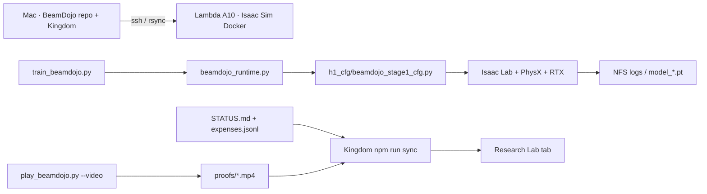

# BeamDojo architecture

## System design

Mac is the orchestrator. Training and RTX video run on a Lambda **A10** (RT cores) inside Isaac Sim 5.1 + Isaac Lab 2.3.2 Docker. BeamDojo source is bind-mounted from NFS so terminate does not wipe code. Checkpoints stay on NFS. Kingdom syncs STATUS, expenses, and proof mp4s into the Research Lab.

## Input / output flows

- **In:** H1 USD, Stage 1 cfg, PPO hyperparams, A10 CUDA
- **Out:** `model_*.pt` on NFS, TensorBoard, RTX mp4 proofs, expense JSONL, STATUS.md

## Data stores

| Store | Type | Path |
|-------|------|------|
| Code | git | ~/Projects/BeamDojo |
| GPU logs | NFS | /lambda/nfs/beamdojo/logs |
| Proof clips | git (small) | ~/Projects/BeamDojo/proofs |
| Spend | JSONL | ~/Projects/BeamDojo/tracking/expenses.jsonl |
| Kingdom mirror | JSON | avinashs-kingdom/public/data/research/ |

## Future plans

- Dual-terrain Stage 1 (flat collision + hidden beam heightfield)
- 1024-env CUDA train, then Stage 2 hard beam
- Unitree G1 + double critic as in the paper
- Do not train until Avinash has a place to copy checkpoints
