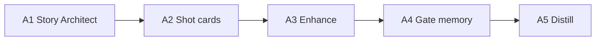

# ComicMainEngine architecture

## System design

Storyboard-first Version 2A parallel to frozen Version 2. Text LLM via OmniRoute; images direct (GOOGLE_API_KEY, fal). Dashboard /v2a on :8770.

## Input / output flows

- **In:** story architect packets, scene cards, storyboard frames
- **Out:** signed episode packets, rendered panels (later phases)

## Data stores

| Store | Type | Path |
|-------|------|------|
| 2A program | JSON | data/v2a_program.json |
| V1 usage | SQLite | data/usage.db |
| V2 (frozen) | JSON | data/v2_program.json |

## Key libraries

- Python comicengine package
- Direct image APIs (never OmniRoute for images)

## Version history

- 2A A0-A1 complete · A2 in progress · V1 22/22 done

## Future plans

- A2 scene cards + storyboard ingest
- Aranya Capture fixture (10 episodes)

## Experiments log

See [[experiments/comic-engine]].
