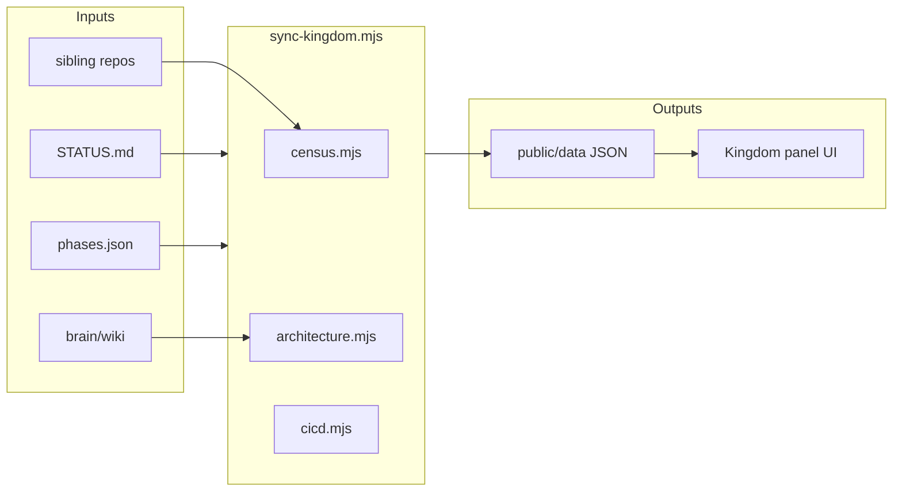

# Kingdom ops architecture

## System design

React + Vite command orchestrator with local control API (:5174). `npm run dev` starts UI + API. Venture **Run** tabs embed live dashboards and expose Start/Stop/Test/Sync buttons. `npm run sync` pulls venture data into `public/data/`.

## Input / output flows

- **In:** sibling repo STATUS.md, phases.json, expenses.jsonl, registry paths, brain/wiki/architecture/*.md
- **Out:** ventures.json, manifests, architecture JSON, live-tracker.md, panel UI via fetch('/data/…')

## Data stores

| Store | Type | Path |
|-------|------|------|
| Panel seed | JSON | public/data/*.json |
| Manifests | JSON | public/data/manifests/ |
| Brain wiki | Markdown | brain/wiki/ |
| User edits | localStorage | avinash-kingdom-v4 |

## Key libraries

- React 19, Vite 8, TypeScript
- sync-kingdom.mjs orchestrator modules (census, architecture, health, cicd)

## Version history

- v1.0 — venture board + sync
- v2.1 — operational control plane (API, embedded dashboards, test runner)

## Future plans

- Raycast hotkey layer (optional)
- Agent trace tab (LangSmith-style)
- Auto-run local tests on sync (opt-in)

## Experiments log

See [[experiments/kingdom-ops]].
