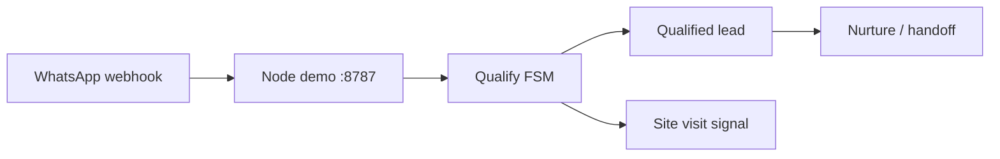

# WhatsApp / Voice architecture

## System design

India SMB WhatsApp lead qualification. RE vertical first. Phase-gated delivery: offer → demo → first rupees. Node demo server on :8787.

## Input / output flows

- **In:** inbound WA webhook (stub → live), broker lead messages
- **Out:** qualified lead record, site-visit booking signal, nurture/handoff paths

## Data stores

| Store | Type | Path |
|-------|------|------|
| Phase gates | JSON | tracking/phases.json |
| Spend log | JSONL | tracking/expenses.jsonl |
| Scripts | Markdown | scripts/real-estate-wa.md |

## Key libraries

- Node.js demo server
- FSM JSON for qualify paths

## Version history

- Stage C · Phase 8 — pilot contract pending

## Future plans

- Phase 8 pilot contract
- Hindi/English qualify → site visit loop
- Voice layer (Exotel) after chat MVP

## Experiments log

See [[experiments/whatsapp-voice]].
