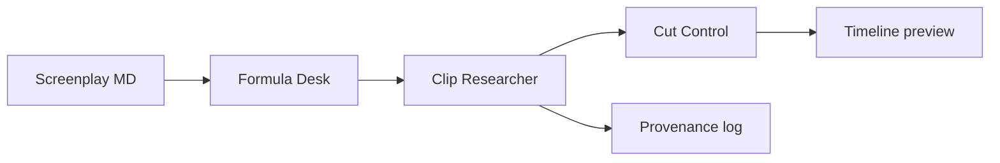

# YouTube editor architecture

## System design

Anti-slop long-form pipeline: Formula Desk to Clip Researcher to Script to Narration to Cut Control to timeline. Real clip provenance required. Phase 4: clip research + cloud sync.

## Input / output flows

- **In:** screenplay markdown, clip candidates (local + GCS/Drive), formula lint rules
- **Out:** selected clips with provenance, timeline preview, Voice Over-ready cut

## Data stores

| Store | Type | Path |
|-------|------|------|
| STATUS | Markdown | STATUS.md |
| SRS | Markdown | docs/SRS.md |
| Clip index | JSON/files | tracking/ (Cut Control state) |

## Key libraries

- Node.js tooling
- Google Cloud Storage / Drive (optional CLIP_CLOUD=gcs)

## Version history

- Phase 4 · Clip research + provenance · 55%

## Future plans

- GCS clip sync
- Phase 5 timeline compiler + preview render

## Experiments log

See [[experiments/youtube-editor]].
